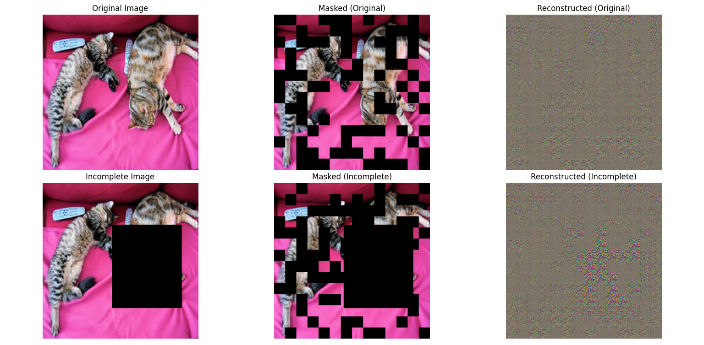

# Vision Transformer (ViT) Image Reconstruction

This project demonstrates the power of Vision Transformers (ViT) for image reconstruction using Facebook's pre-trained ViT-MAE (Masked Autoencoder) model. The implementation showcases how ViT can intelligently reconstruct missing or masked portions of images by learning contextual relationships between image patches.

## 🎯 Project Overview

The Vision Transformer approach divides images into patches and uses self-attention mechanisms to understand spatial relationships. This project specifically focuses on:

- **Masked Image Modeling**: Randomly masking image patches and reconstructing them
- **Image Inpainting**: Demonstrating reconstruction capabilities on artificially damaged images
- **Comparative Analysis**: Showing reconstruction quality differences between complete and incomplete input images

## 🖼️ Results



The visualization shows a 2×3 grid comparison:
- **Top Row**: Original complete image → Masked version → ViT reconstruction
- **Bottom Row**: Artificially damaged image → Masked version → ViT reconstruction

## 🔧 Technical Implementation

### Key Components:
- **Model**: Facebook's `vit-mae-base` pre-trained model
- **Input Processing**: 224×224 images divided into 16×16 pixel patches (14×14 = 196 patches total)
- **Masking Strategy**: Random masking of ~40% of image patches
- **Reconstruction**: Self-attention based prediction of masked regions

### Architecture Details:
```python
# Model Configuration
Processor: ViTImageProcessor
Model: ViTForMaskedImageModeling
Patch Size: 16×16 pixels
Image Resolution: 224×224
Total Patches: 196 (14×14 grid)
Masking Ratio: 40% (configurable)
```

## 🚀 Getting Started

### Prerequisites
```bash
pip install transformers torch torchvision Pillow matplotlib numpy requests
```

### Running the Code
```bash
python ViT_model.py
```

The script will:
1. Download a sample image from COCO dataset
2. Create an artificially damaged version
3. Apply random masking to both versions
4. Generate reconstructions using the ViT model
5. Display comparative visualizations

## 📊 Features

- **Dual Image Processing**: Compares reconstruction on both complete and incomplete images
- **Interactive Visualization**: Clear before/after comparisons with matplotlib
- **Configurable Masking**: Adjustable mask ratio for different reconstruction challenges
- **Real-world Application**: Demonstrates practical image inpainting capabilities

## 🔬 Applications

This technology can be applied to:
- **Image Restoration**: Repairing damaged or corrupted images
- **Content-Aware Fill**: Intelligent removal of unwanted objects
- **Medical Imaging**: Reconstructing missing scan data
- **Art Restoration**: Digital restoration of damaged artworks
- **Surveillance**: Enhancing unclear or partially occluded footage

## 🛠️ Code Structure

- `ViT_model.py`: Main implementation file
- `reconstruct()`: Core function handling masking and reconstruction
- Visualization pipeline for comparative analysis
- Preprocessing and post-processing utilities

## 📈 Performance Insights

The Vision Transformer demonstrates remarkable ability to:
- Understand spatial context across image patches
- Reconstruct semantically meaningful content
- Maintain consistency with surrounding visual elements
- Handle both random masking and structured damage

## 🤝 Contributing

Feel free to contribute by:
- Testing with different image types
- Experimenting with various masking strategies
- Implementing additional ViT variants
- Adding new evaluation metrics

## 📝 License

This project is open source and available under the MIT License.

---

*Built with ❤️ using Hugging Face Transformers and PyTorch*